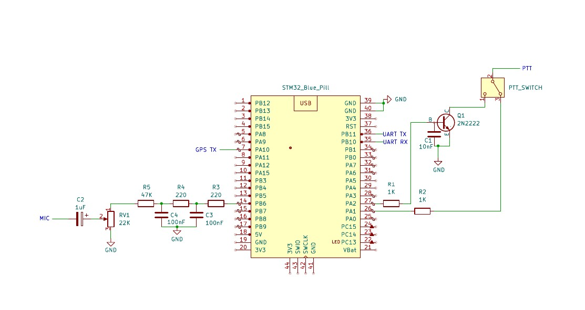
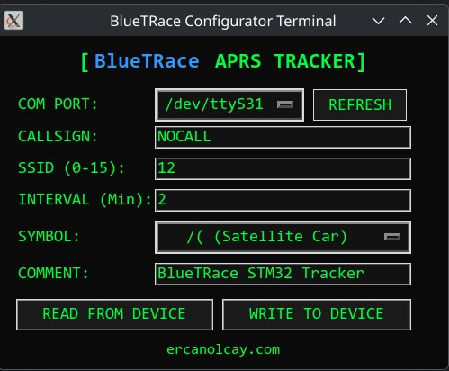

# BlueTRace
**STM32 Blue Pill Based APRS Tracker**

BlueTRace is a high-performance, open-source hardware and software solution designed for Amateur Radio APRS (Automatic Packet Reporting System) tracking. It is specifically engineered to bridge the gap between modern digital control and legacy radio systems, offering specialized support for **AnyTone AT-779UV** microphone protocols while maintaining universal compatibility with standard PTT-to-GND radio systems.

## 🛠 Project Overview
The system is built on the **STM32F103C8T6 (Blue Pill)** MCU using a bare-metal C implementation. It focuses on signal precision, low latency, and ease of configuration.

### Key Technical Features
- **Firmware Architecture:** Bare-metal STM32 implementation optimized for AX.25 packet timing.
- **Memory Optimization:** Utilizes **4-byte memory alignment** (32-bit alignment) for high-speed data handling and stable DMA buffer management.
- **Universal Interface:** Integrated switching via a 2N2222 transistor stage to handle both serial-driven mic lines (AnyTone) and standard PTT lines.
- **Audio Path:** Filtered audio output for clean AFSK (Audio Frequency Shift Keying) transmission.

## 📐 Hardware Schematic
The design includes a GPS interface, a robust PTT switching stage, and precision audio filtering.

## 🖥 BlueTRace Configurator Tool
The **BlueTRace Configurator** is a modern utility that allows users to tune APRS parameters (Callsign, SSID, TX Interval, Symbols, and Comments) in real-time.

### Deployment Options (Available in [Releases](../../releases))
I provide the Configurator in two primary formats to ensure portability:

#### 1. Windows (Standalone Executable)
- **Format:** `BlueTRace_Config.exe` (**One-File Executable**).
- **Usage:** Download and run. No Python installation, drivers, or external libraries required. 
- **Build Method:** Compiled using PyInstaller with the `--onefile --windowed` flags for a clean, single-file experience.

#### 2. Linux (Python Script)
- **Format:** `BlueTRace_Config.py` (Standalone Script).
- **Usage:** Run directly via terminal: `python3 BlueTRace_Config.py`.
- **Dependencies:** Requires `pyserial` and `tkinter`. Ensure your user is in the `dialout` group to access serial ports.

---
## 🤝 Acknowledgments
Special thanks to the authors of these projects which inspired BlueTRace:
- **SQ8VPS (VP-Digi):** For the [vp-digi](https://github.com/sq8vps/vp-digi) project.
- **unsword01:** For the [AnyTone-AT779-Mic-Serial](https://github.com/unsword01/AnyTone-AT779-Mic-Serial) project.
---
## 👨‍💻 Author
**Ercan Olcay** [ercanolcay.com](http://ercanolcay.com)

---
